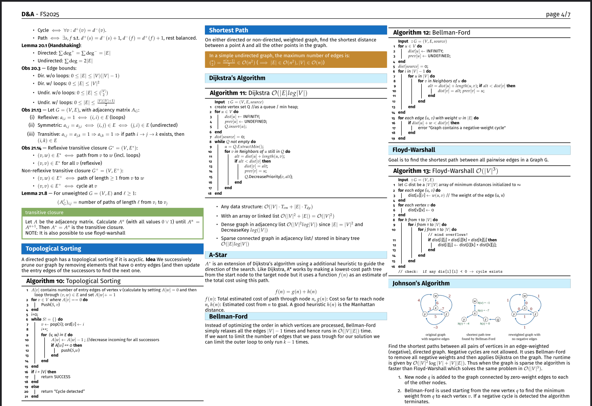

# LaTeX Cheatsheet Template

A compact, multi-column LaTeX template for writing your own cheatsheets, lecture notes, or quick references.  
Designed to squeeze the maximum amount of useful information onto a few pages without looking like garbage.

  
*(example output)*

---

## Features
- robust multi-column layout (`2–4` columns supported)
- custom section styles with colored boxes
- preconfigured environments:
  - `recipe` for step-by-step solution strategies
  - `warning` for important theorems / pitfalls
- syntax-highlighted code listings with [`minted`](https://ctan.org/pkg/minted)
- compact mode (`\compactmodetrue`) to shrink formulas and lists even more
- footnotes, math, tables, and other standard LaTeX goodies

## Getting Started
Clone this repo as a starting point for your own cheatsheet:

```bash
git clone https://git.0210010.xyz/ethRW/cheatsheet_template my_cheatsheet
cd my_cheatsheet
````

Edit your content in [`content/content.tex`](content/content.tex), then build:

```bash
pdflatex -shell-escape main.tex
```

The `-shell-escape` flag is required for `minted` (syntax highlighting).

## Requirements
* A LaTeX distribution (e.g. TeX Live, MiKTeX)
* `pdflatex` (or `latexmk` if you prefer automated builds)
* Python with [Pygments](https://pygments.org/) (for `minted`)

## License
This template is released under the [MIT License](LICENSE).
Do whatever you want with it, but don’t sue me if it breaks.